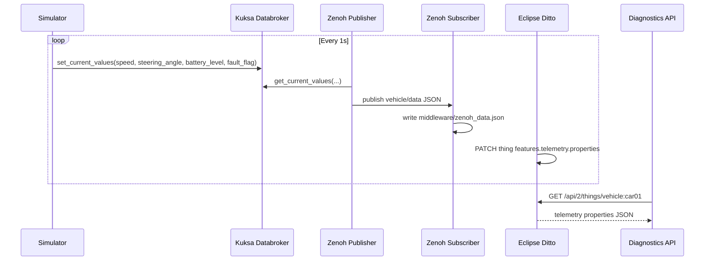

# Iteration 1: Baseline SDV Pipeline (Kuksa → Zenoh → Ditto)

This project implements an end-to-end Software-Defined Vehicle (SDV) data pipeline aligned with the baseline flow used in the reference repository:

Vehicle Data Source → Eclipse Kuksa → Middleware (Zenoh) → Eclipse Ditto → Monitoring API

## 1) Project Overview

The pipeline generates simulated vehicle telemetry, writes it to Kuksa, relays current values through Zenoh, persists the latest state in Eclipse Ditto, and exposes diagnostics endpoints through a lightweight OpenSOVD-style API.

### Vendored Ditto Source

The `ditto-server/` directory is included directly in this repository as a vendored copy of Eclipse Ditto from `https://github.com/eclipse-ditto/ditto.git`.
It was imported from upstream commit `afabcfbd18352aa5ad6aea02c802ef33d7882a98` so collaborators can access the Ditto server source from this repository without needing a separate clone.

### Core Components and Roles

- `simulator/generate_vehicle_data.py`: Generates telemetry (`speed`, `steering_angle`, `battery_level`) and one functional modification variable (`fault_flag`).
- `kuksa/send_to_kuksa.py`: Pushes generated telemetry into Kuksa Databroker.
- `kuksa/retrieve_from_kuksa.py`: Reads back telemetry from Kuksa for verification.
- `middleware/zenoh_publisher.py`: Reads from Kuksa and publishes JSON payloads to Zenoh key `vehicle/data`.
- `middleware/zenoh_subscriber.py`: Subscribes to Zenoh and stores latest payload in `middleware/zenoh_data.json`.
- `ditto/create_twin.py`: Creates/updates Ditto policy and thing from config.
- `ditto/send_to_ditto.py`: Uses reference-style Ditto helper functions and patches telemetry in Ditto.
- `diagnostics/opensovd_server.py`: Exposes diagnostics over HTTP.

## 2) System Architecture Diagram

```mermaid
flowchart LR
	A[Vehicle Data Generator\nsimulator/generate_vehicle_data.py]
	B[Eclipse Kuksa Databroker\nPort 55555]
	C[Zenoh Publisher\nmiddleware/zenoh_publisher.py]
	D[Zenoh Network\nKey: vehicle/data]
	E[Zenoh Subscriber\nmiddleware/zenoh_subscriber.py]
	F[Eclipse Ditto\nThing: vehicle:car01]
	G[Diagnostics API\ndiagnostics/opensovd_server.py]

	A -->|vehicle_data.json| B
	B --> C
	C --> D
	D --> E
	E -->|zenoh_data.json| F
	F --> G
```



## 3) Runtime Sequence Diagram



## 4) Functional Modification (Iteration 1 Requirement)

Implemented modification: **simulated sensor fault flag** (`fault_flag`).

- Added at the data source (`simulator/generate_vehicle_data.py`).
- Propagated through Kuksa, Zenoh, and Ditto.
- Exposed by diagnostics endpoint `/diagnostics/faults`.

## 5) Prerequisites

- Python 3.11+
- Docker Desktop (for Kuksa and Ditto)
- Running services:
  - Kuksa Databroker on `127.0.0.1:55555`
  - Eclipse Ditto on `http://localhost:8080`

Install Python dependencies:

```bash
pip install -r requirements.txt
```

## 6) Start External Services

### Start Kuksa Databroker (example)

```bash
docker run --rm -it -p 55555:55555 -v "${PWD}/OBD.json:/OBD.json" ghcr.io/eclipse-kuksa/kuksa-databroker:main --insecure --vss /OBD.json
```

### Start Eclipse Ditto

Use the Ditto Docker deployment (`deployment/docker`) and confirm:

- `http://localhost:8080` is reachable
- basic auth credentials: `ditto` / `ditto`

## 7) Run Pipeline (Order)

Open separate terminals from project root:

1. Generate source data

```bash
python simulator/generate_vehicle_data.py
```

2. Send source data to Kuksa

```bash
python kuksa/send_to_kuksa.py
```

3. (Optional) Verify reads from Kuksa

```bash
python kuksa/retrieve_from_kuksa.py
```

4. Create Ditto thing and policy

```bash
python ditto/create_twin.py
```

5. Publish Kuksa data to Zenoh

```bash
python middleware/zenoh_publisher.py
```

6. Subscribe and persist latest Zenoh payload

```bash
python middleware/zenoh_subscriber.py
```

7. Push middleware payload into Ditto

```bash
python ditto/send_to_ditto.py
```

8. Start diagnostics API

```bash
python diagnostics/opensovd_server.py
```

## 8) Verification and Evidence Collection

Iteration 1 asks for proof that data flows end-to-end. Collect evidence from:

1. **Kuksa logs/output**
   - `Sent to Kuksa: {...}`
   - `Retrieved from Kuksa: {...}`

2. **Zenoh logs/output**
   - `Published to Zenoh: {...}`
   - `Received from Zenoh: {...}`

3. **Ditto update logs/output**
   - `Updated Ditto: {...}`

4. **API output**

```bash
curl http://localhost:5001/diagnostics/state
curl http://localhost:5001/diagnostics/faults
```

Expected behavior: changing telemetry values at the simulator appears in Kuksa, then in Zenoh payload, then in Ditto thing `vehicle:car01`, and finally through diagnostics endpoints.

## 9) Configuration Files

- `config/policy.json`: Ditto policy definition.
- `config/VSS_Ditto.json`: Ditto thing template used for initialization.

## 10) Iteration 1 Deliverable Coverage

- Updated architecture diagram: included in Section 2.
- Sequence diagram: included in Section 3.
- SDV components and roles: Section 1.
- Evidence of data flow: Section 8 (logs + API checks).
- Functional modification description: Section 4 (`fault_flag`).