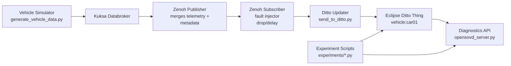

# Iteration 2: SDV Pipeline Extension, Validation, and Evaluation

This repository contains an end-to-end Software-Defined Vehicle (SDV) data pipeline:

Simulator -> Kuksa Databroker -> Zenoh Middleware -> Eclipse Ditto Digital Twin -> OpenSOVD-style Diagnostics API

Iteration 2 extends the Iteration 1 baseline with communication fault injection and measurable latency instrumentation, then adds reproducible scripts for functional and non-functional evaluation.

## 1. What Was Extended in Iteration 2

Implemented extension (least-complex, high-value):

1. Middleware fault injection
- Location: middleware/zenoh_subscriber.py
- New behavior:
  - Configurable message drop probability with ZENOH_DROP_PROB
  - Configurable artificial delay with ZENOH_DELAY_MS

2. End-to-end telemetry instrumentation
- Locations:
  - simulator/generate_vehicle_data.py
  - middleware/zenoh_publisher.py
  - middleware/zenoh_subscriber.py
  - ditto/send_to_ditto.py
  - diagnostics/opensovd_server.py
- New telemetry metadata:
  - vehicle_id
  - sequence
  - generated_at_ms
  - middleware_received_at_ms
- Diagnostics now returns computed end_to_end_latency_ms when generated_at_ms is present.

3. Load control
- Location: simulator/generate_vehicle_data.py
- New behavior:
  - Configurable simulator update interval with SIM_INTERVAL_SEC for higher-rate tests.

## 2. Updated Architecture (Iteration 2)



## 3. Repository Structure (Core)

```text
sdv-pipeline/
|-- simulator/
|   `-- generate_vehicle_data.py
|-- kuksa/
|   |-- send_to_kuksa.py
|   `-- retrieve_from_kuksa.py
|-- middleware/
|   |-- zenoh_publisher.py
|   |-- zenoh_subscriber.py
|   `-- zenoh_data.json
|-- ditto/
|   |-- create_twin.py
|   `-- send_to_ditto.py
|-- diagnostics/
|   `-- opensovd_server.py
|-- experiments/
|   |-- validate_pipeline.py
|   |-- run_latency_experiment.py
|   |-- compare_latency_results.py
|   `-- results/
|-- config/
|   |-- VSS_Ditto.json
|   `-- policy.json
`-- requirements.txt
```

## 4. Prerequisites

Required software:
- Python 3.11+
- Docker Desktop
- Running Kuksa Databroker
- Running Eclipse Ditto

Install Python dependencies:

```bash
pip install -r requirements.txt
```

## 5. Start External Services

### Start Kuksa Databroker (example)

```bash
docker run --rm -it -p 55555:55555 -v "${PWD}/OBD.json:/OBD.json" ghcr.io/eclipse-kuksa/kuksa-databroker:main --insecure --vss /OBD.json
```

### Start Eclipse Ditto

Use deployment files in ditto-server/deployment/docker.

Verify:

```text
http://localhost:8080
```

Default credentials:
- username: ditto
- password: ditto

## 6. Run the Pipeline

Open separate terminals in repository root and run:

```bash
python simulator/generate_vehicle_data.py
python kuksa/send_to_kuksa.py
python kuksa/retrieve_from_kuksa.py
python middleware/zenoh_publisher.py
python middleware/zenoh_subscriber.py
python ditto/create_twin.py
python ditto/send_to_ditto.py
python diagnostics/opensovd_server.py
```

## 7. Iteration 2 Configuration Knobs

Set these environment variables before starting related processes.

### Simulator load

- SIM_INTERVAL_SEC
  - Default: 1.0
  - Example (5 Hz):

```bash
# PowerShell
$env:SIM_INTERVAL_SEC="0.2"
python simulator/generate_vehicle_data.py
```

### Middleware fault injection

- ZENOH_DROP_PROB
  - Default: 0.0
  - Example: 0.20 means 20% messages dropped at middleware
- ZENOH_DELAY_MS
  - Default: 0
  - Example: 150 adds 150 ms delay before subscriber writes payload

```bash
# PowerShell
$env:ZENOH_DROP_PROB="0.20"
$env:ZENOH_DELAY_MS="150"
python middleware/zenoh_subscriber.py
```

## 8. Functional Validation (Iteration 2 Requirement)

### A. Manual API check

```bash
curl http://127.0.0.1:5001/diagnostics/state
```

Expected fields:
- speed
- steering_angle
- battery_level
- fault_flag
- vehicle_id
- sequence
- generated_at_ms
- middleware_received_at_ms
- end_to_end_latency_ms (when timestamp available)

### B. Automated functional validation

```bash
python experiments/validate_pipeline.py --samples 10 --interval 1.0
```

Pass criteria:
- all required fields are present
- sequence is valid and non-regressive
- diagnostics endpoint remains responsive

## 9. Non-Functional Experiment: Latency Measurement

This project provides a simple reproducible experiment to measure end-to-end latency.

### Step 1: Baseline run (no middleware faults)

```bash
$env:ZENOH_DROP_PROB="0.0"
$env:ZENOH_DELAY_MS="0"
python experiments/run_latency_experiment.py --label baseline --samples 30
```

### Step 2: Modified run (fault injection active)

```bash
$env:ZENOH_DROP_PROB="0.20"
$env:ZENOH_DELAY_MS="150"
python experiments/run_latency_experiment.py --label fault_injection --samples 30
```

### Step 3: Compare results and generate table/chart markdown

```bash
python experiments/compare_latency_results.py --baseline experiments/results/latency_samples_baseline.csv --modified experiments/results/latency_samples_fault_injection.csv --output experiments/results/latency_comparison.md
```

Generated artifacts:
- experiments/results/latency_samples_baseline.csv
- experiments/results/latency_samples_fault_injection.csv
- experiments/results/latency_summary_baseline.md
- experiments/results/latency_summary_fault_injection.md
- experiments/results/latency_comparison.md

These markdown outputs include table and Mermaid chart content for report inclusion.

## 10. Diagnostics Endpoints

- Vehicle state:
  - http://127.0.0.1:5001/diagnostics/state
- Fault view:
  - http://127.0.0.1:5001/diagnostics/faults

## 11. Notes

- Keep all services on localhost defaults unless your environment requires overrides.
- If your Kuksa model does not expose the fault path, existing fallback behavior remains in place.

