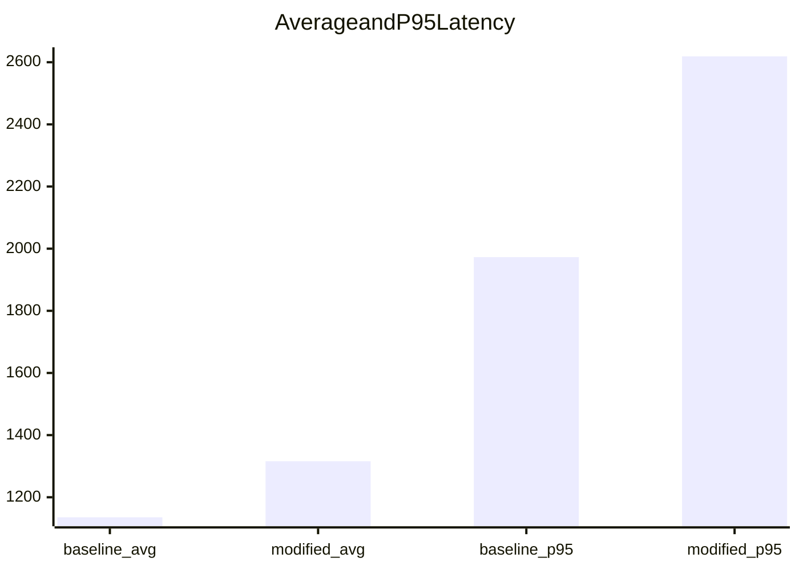

# Latency Comparison (Baseline vs Modified)

| Metric | Baseline (ms) | Modified (ms) | Change |
|---|---:|---:|---:|
| min_ms | 263.0 | 552.0 | 109.89% |
| avg_ms | 1135.57 | 1315.93 | 15.88% |
| p95_ms | 1972.85 | 2618.95 | 32.75% |
| max_ms | 1991.0 | 3032.0 | 52.29% |
| sample_count | 30 | 30 | n/a |

