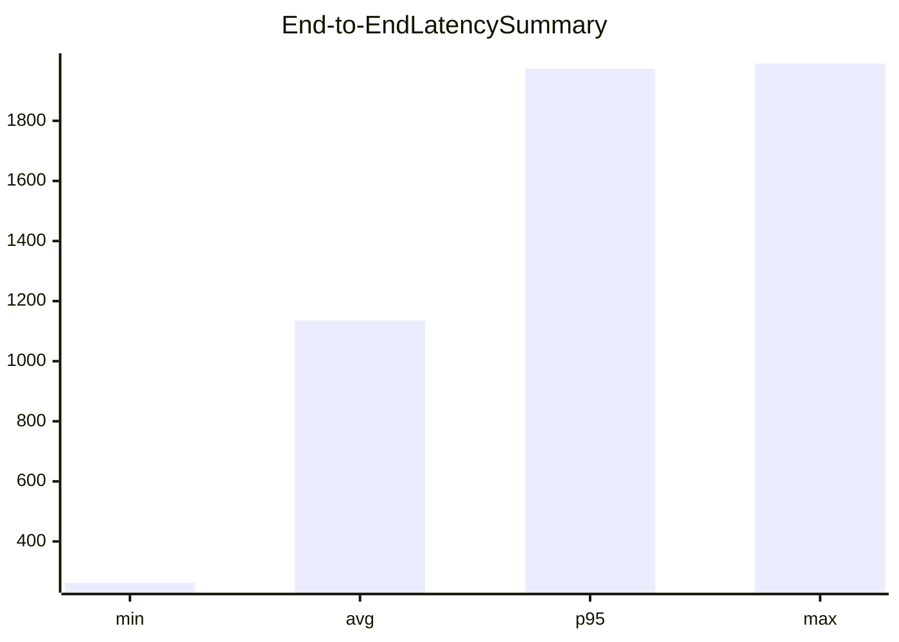

# Latency Summary: baseline

| Metric | Value (ms) |
|---|---:|
| min_ms | 263 |
| avg_ms | 1135.57 |
| p95_ms | 1972.85 |
| max_ms | 1991 |
| sample_count | 30 |

Mermaid chart:

```mermaid
xychart-beta
    title End-to-End Latency Summary
    x-axis [min, avg, p95, max]
    bar [263, 1135.57, 1972.85, 1991]
```
