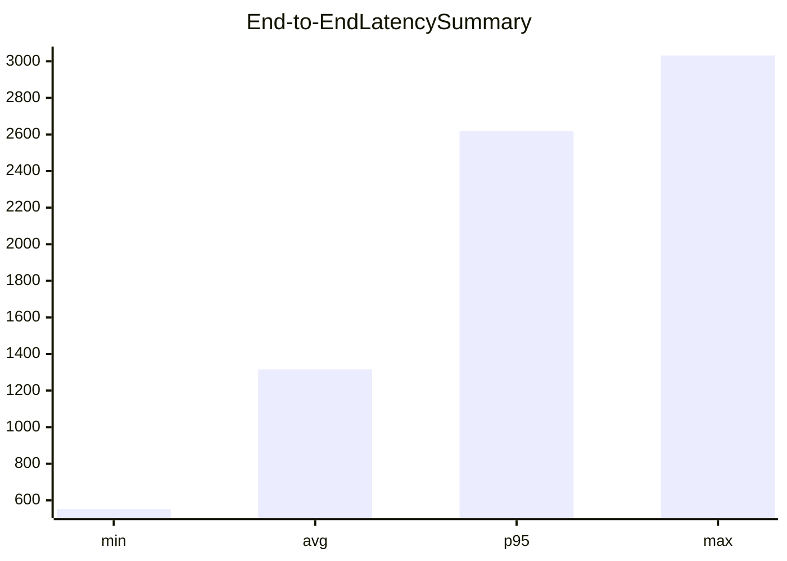

# Latency Summary: delay

| Metric | Value (ms) |
|---|---:|
| min_ms | 552 |
| avg_ms | 1315.93 |
| p95_ms | 2618.95 |
| max_ms | 3032 |
| sample_count | 30 |

Mermaid chart:

```mermaid
xychart-beta
    title End-to-End Latency Summary
    x-axis [min, avg, p95, max]
    bar [552, 1315.93, 2618.95, 3032]
```
