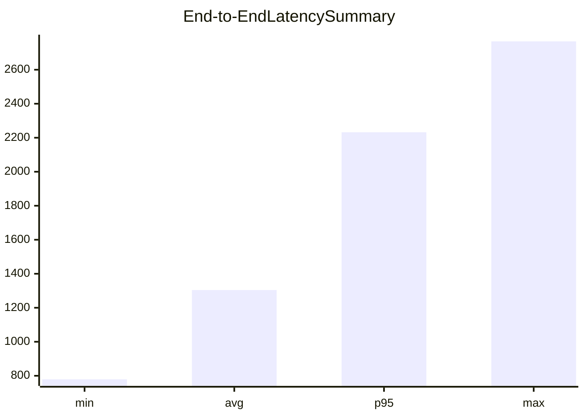

# Latency Summary: stress

| Metric | Value (ms) |
|---|---:|
| min_ms | 779 |
| avg_ms | 1304.3 |
| p95_ms | 2232.4 |
| max_ms | 2767 |
| sample_count | 30 |

Mermaid chart:

```mermaid
xychart-beta
    title End-to-End Latency Summary
    x-axis [min, avg, p95, max]
    bar [779, 1304.3, 2232.4, 2767]
```
