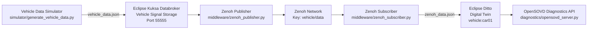
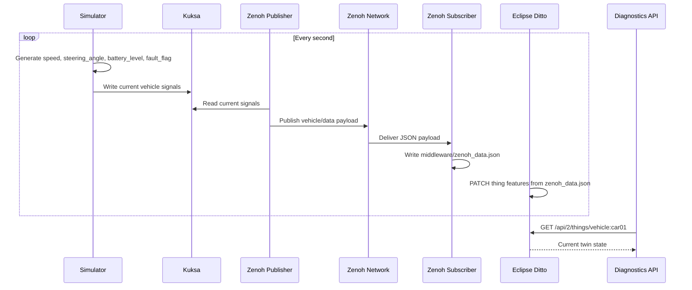

# Iteration 1: Baseline SDV Pipeline (Kuksa -> Zenoh -> Ditto)

This project implements an end-to-end Software-Defined Vehicle (SDV) data pipeline aligned with the baseline architecture used in the SDV reference repository.

Vehicle Data Source -> Eclipse Kuksa -> Middleware (Zenoh) -> Eclipse Ditto -> OpenSOVD Diagnostics API

The goal of Iteration 1 is to demonstrate that vehicle telemetry successfully propagates through the entire SDV pipeline from the simulator to the digital twin backend and diagnostics interface.

---

# 1. Project Overview

The system simulates vehicle telemetry and propagates it through a distributed SDV pipeline.

Pipeline workflow:

1. Generate simulated vehicle telemetry
2. Send telemetry to Eclipse Kuksa Databroker
3. Retrieve signals from Kuksa
4. Publish telemetry through Zenoh middleware
5. Receive messages via the Zenoh subscriber
6. Update the Eclipse Ditto digital twin
7. Expose vehicle state through an OpenSOVD-style diagnostics API

Telemetry signals include:

- `speed`
- `steering_angle`
- `battery_level`
- `fault_flag` (Iteration 1 functional modification)

---

# Vendored Ditto Source

The `ditto-server/` directory is included directly in this repository as a vendored copy of Eclipse Ditto.

Source repository:

https://github.com/eclipse-ditto/ditto.git

Imported upstream commit:

`afabcfbd18352aa5ad6aea02c802ef33d7882a98`

This allows collaborators and graders to access the Ditto server source directly from this repository without cloning the project separately.

---

# 2. System Architecture Diagram



# 3. Runtime Sequence Diagram



# 4. Functional Modification (Iteration 1 Requirement)

Iteration 1 requires implementing at least one functional modification.

Implemented modification:

Simulated sensor fault flag (`fault_flag`)

Location:

`simulator/generate_vehicle_data.py`

Behavior:

- Randomly generates simulated sensor faults
- Propagates through the entire pipeline
- Stored in the Ditto digital twin
- Exposed through diagnostics endpoint `/diagnostics/faults`

# 5. Repository Structure

```text
sdv-pipeline/
|
|-- simulator/
|   `-- generate_vehicle_data.py
|
|-- kuksa/
|   |-- send_to_kuksa.py
|   `-- retrieve_from_kuksa.py
|
|-- middleware/
|   |-- zenoh_publisher.py
|   |-- zenoh_subscriber.py
|   `-- zenoh_data.json
|
|-- ditto/
|   |-- create_twin.py
|   `-- send_to_ditto.py
|
|-- diagnostics/
|   `-- opensovd_server.py
|
|-- config/
|   |-- policy.json
|   `-- VSS_Ditto.json
|
`-- requirements.txt
```

# 6. Prerequisites

Required software:

- Python 3.11+
- Docker Desktop
- Zenoh Python library
- Running Kuksa Databroker
- Running Eclipse Ditto

Install dependencies:

```bash
pip install -r requirements.txt
```

# 7. Start External Services

## Start Kuksa Databroker

Example command:

```bash
docker run --rm -it -p 55555:55555 -v "${PWD}/OBD.json:/OBD.json" ghcr.io/eclipse-kuksa/kuksa-databroker:main --insecure --vss /OBD.json
```

### Windows Note

On Windows systems Kuksa runs on:

`127.0.0.1:55555`

Make sure port `55555` is available and not blocked by your firewall.

## Start Eclipse Ditto

Use the Ditto Docker deployment located in:

`ditto-server/deployment/docker`

Verify Ditto is accessible:

`http://localhost:8080`

Default credentials:

- Username: `ditto`
- Password: `ditto`

# 8. Run the Pipeline

Open separate terminals and run the following commands.

## Generate simulated telemetry

```bash
python simulator/generate_vehicle_data.py
```

## Send telemetry to Kuksa

```bash
python kuksa/send_to_kuksa.py
```

## Verify Kuksa retrieval

```bash
python kuksa/retrieve_from_kuksa.py
```

## Publish telemetry to Zenoh

```bash
python middleware/zenoh_publisher.py
```

## Subscribe to Zenoh messages

```bash
python middleware/zenoh_subscriber.py
```

## Create Ditto digital twin

```bash
python ditto/create_twin.py
```

## Update Ditto digital twin

```bash
python ditto/send_to_ditto.py
```

## Start OpenSOVD diagnostics server

```bash
python diagnostics/opensovd_server.py
```

# 9. API Access and Diagnostics

Once the pipeline is running, vehicle state can be accessed through the diagnostics API.

## OpenSOVD Endpoints

Vehicle state:

`http://localhost:5001/diagnostics/state`

Vehicle fault information:

`http://localhost:5001/diagnostics/faults`

Example query:

```bash
curl http://localhost:5001/diagnostics/state
```

Example response:

```json
{
	"speed": 51,
	"steering_angle": 24,
	"battery_level": 31,
	"fault_flag": 1
}
```

# 10. Direct Ditto API Queries

The digital twin can also be queried directly from Ditto.

```bash
curl -u ditto:ditto http://localhost:8080/api/2/things/vehicle:car01
```

This returns the full digital twin state.

# 11. Verification and Evidence Collection

Iteration 1 requires proof that telemetry flows through the entire system.

Evidence can be collected from:

## Kuksa logs

- `Sent to Kuksa: {...}`
- `Retrieved from Kuksa: {...}`

## Zenoh logs

- `Published to Zenoh: {...}`
- `Received from Zenoh: {...}`

## Ditto updates

- `Updated Ditto: {...}`

## Diagnostics API output

```bash
curl http://localhost:5001/diagnostics/state
curl http://localhost:5001/diagnostics/faults
```

Expected behavior:

Telemetry values generated by the simulator appear sequentially in:

Simulator -> Kuksa -> Zenoh -> Ditto -> Diagnostics API

# 12. Configuration Files

`config/policy.json`

Defines Ditto access policy.

`config/VSS_Ditto.json`

Defines the Ditto thing template used for digital twin initialization.
